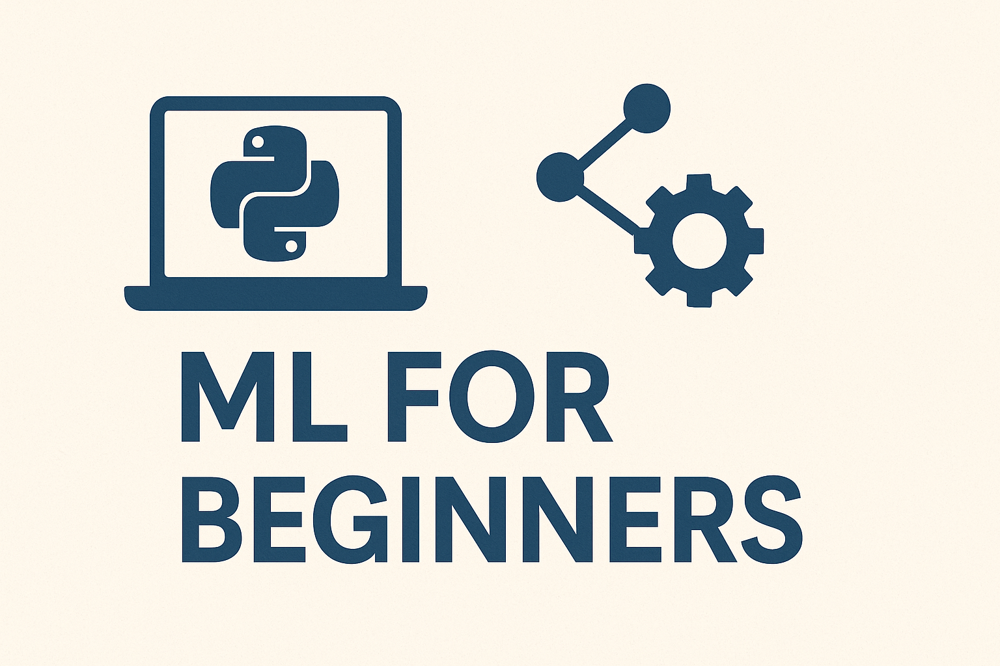

# 📘 ML-For-Beginners


[](https://www.latex-project.org/)
[](LICENSE)
[](https://github.com/Dlzxn/ML-For-Beginners/pulls)
[](./ML-For-Beginners.pdf)
---

---

> **A clean, structured and beginner-friendly guide to Machine Learning — written entirely in LaTeX.**  
> Theory, math, and models — explained from the ground up.

---

## 📚 What’s inside?

- 📖 **ML Textbook** — fully typeset in LaTeX with beautiful math and visuals.
- 🧠 **Concepts Covered**:
  - Supervised and unsupervised learning
  - Linear & logistic regression
  - Decision trees, k-NN, SVMs
  - Clustering algorithms
  - Introduction to neural networks
- 🧮 **Math Foundations**:
  - Linear algebra
  - Probability theory & statistics
  - Calculus for ML (gradients, partial derivatives)
  - Optimization (gradient descent and beyond)
- 🛠️ **Code Coming Soon** — clean Python examples with `NumPy`, `scikit-learn`, and `PyTorch`.
- 🎓 **Perfect for students, autodidacts, and anyone who prefers clarity over jargon.**

---

## 🚀 Getting Started

For start:
```bash
git clone https://github.com/Dlzxn/ML-For-Beginners.git
cd ML-For-Beginners
